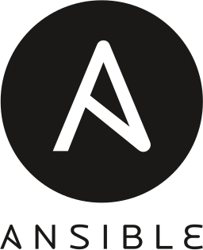

= Hi there, I’m Attila volunteer and programmer👋

== I’m volunteer at

[.float-group]
--
[.left]
image::logos/wwf-logo.svg[WWF, link=https://www.wwf.hu/, width=100rem]
image::logos/greenpeace-logo.svg[Greenpeace, link=https://www.greenpeace.org/hungary/, width=100rem]
image::logos/hungarian-red-cross.svg[Hungarian Red Cross, link=https://voroskereszt.hu/en/about-us/vision-of-the-hungarian-red-cross/, width=100rem]
--

== Integrated development environment (IDE)

[.float-group]
--
[.left]
image::icons/visual-studio-code-icon.svg[Visual Studio Code, link=https://code.visualstudio.com/, width=50rem]
image::icons/vim-icon.svg[Vim, link=https://www.vim.org/, width=50rem]
--

== Shells

[.float-group]
--
[.left]

image::icons/powershell-icon.svg[PowerShell, link=https://docs.microsoft.com/en-us/powershell/, width=50rem]
--

== Tools

[.float-group]
--
[.left] 
image::icons/angular-icon.svg[Angular, link=https://angular.io/, width=50rem]
image::icons/node-js-icon.svg[Node.js, link=https://nodejs.org/en/, width=50rem]
--

=== Infrastructure as code (IaC)

[.float-group]
--
[.left]

--

=== Network File Systems

[.float-group]
--
[.left]

NFS server, iSCSI
--

=== Programming languages

https://github.com/attilasomogyi/attilasomogyi[image:https://github-readme-stats.vercel.app/api/top-langs/?username=attilasomogyi&langs_count=10[Top
Langs]]

image:https://github-readme-stats.vercel.app/api?username=attilasomogyi&show_icons=true["attilasomogyi’s
GitHub stats"]
