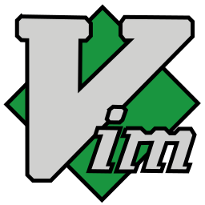
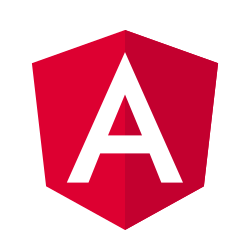
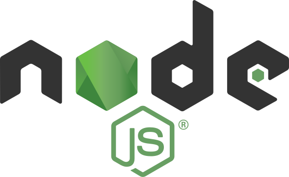

# Hi there, I'm Attila volunteer and programmer👋
## I'm volunteer at:

<a target="_blank" href="https://wwf.hu/"></a>

<a target="_blank" href="https://www.greenpeace.org/hungary/"></a>

<a target="_blank" href="https://voroskereszt.hu/en/about-us/vision-of-the-hungarian-red-cross/"></a>

## :hammer: Integrated development environment (IDE)

<p float=left>


</p>

## :hammer: Tools

<p float="left">


</p>

## :scroll: Programming languages

[](https://github.com/attilasomogyi/attilasomogyi)

## :bar_chart: Weekly development breakdown
<!--START_SECTION:waka-->

```text
Total Time: 0 secs

Markdown   0 secs          ░░░░░░░░░░░░░░░░░░░░░░░░░   00.00 %
XML        0 secs          ░░░░░░░░░░░░░░░░░░░░░░░░░   00.00 %
```

<!--END_SECTION:waka-->


